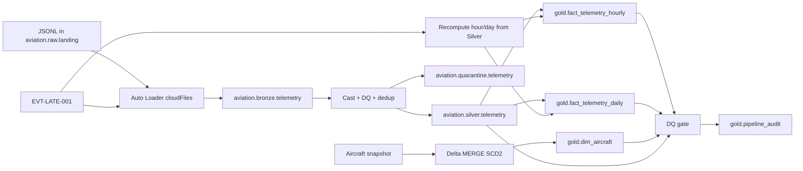

# Databricks Aviation Lakehouse

Databricks Unity Catalog pipeline for aircraft telemetry. Raw JSONL lands in a Volume, Auto Loader loads Bronze, Silver applies types / DQ / dedup, Quarantine keeps rejects, and Gold stores hourly and daily facts plus an SCD Type 2 aircraft dimension.

Notebooks are the runnable source. This repo does not include workspace URLs, tokens, or Auto Loader checkpoints.

## Architecture



## Unity Catalog

| Object | Name |
| --- | --- |
| Catalog | `aviation` |
| Schemas | `raw`, `bronze`, `silver`, `quarantine`, `gold` |
| Volume | `aviation.raw.landing` → `/Volumes/aviation/raw/landing/` |
| Landing files | `/Volumes/aviation/raw/landing/telemetry/` |
| Schema location | `/Volumes/aviation/raw/landing/_schemas/telemetry` |
| Checkpoint | `/Volumes/aviation/raw/landing/_checkpoints/bronze_telemetry` |

## Table grains

| Table | Grain |
| --- | --- |
| `aviation.bronze.telemetry` | one ingested row (Auto Loader checkpoint prevents re-reading the same file) |
| `aviation.silver.telemetry` | `event_id` |
| `aviation.quarantine.telemetry` | rejected / duplicate bronze rows |
| `aviation.silver.aircraft` | `aircraft_id` snapshot |
| `aviation.gold.fact_telemetry_hourly` | `aircraft_id` + `flight_id` + `telemetry_hour` |
| `aviation.gold.fact_telemetry_daily` | `aircraft_id` + `flight_id` + `telemetry_date` |
| `aviation.gold.dim_aircraft` | one SCD2 version: `aircraft_id` + `effective_from` |
| `aviation.gold.pipeline_audit` | one row per DQ-gate run (`batch_id`) |

Hourly and daily metrics: `sample_count`, `avg_altitude_ft`, `avg_ground_speed_kts`, `avg_engine_temp_c`, `max_engine_temp_c`, `min_fuel_remaining_kg`.

Column detail: [docs/data_dictionary.md](docs/data_dictionary.md).

## Notebooks

| Notebook | Purpose |
| --- | --- |
| `00_setup.py` | Create catalog / schemas / volume, write sample JSONL, optional reset of tables and Auto Loader state |
| `01_bronze_telemetry.py` | Auto Loader (`cloudFiles`) JSON → `bronze.telemetry`, `availableNow=True`, `_ingest_ts` |
| `02_silver_telemetry.py` | Type casts, DQ, dedup by `event_id`, rejects → `quarantine.telemetry` with `_reject_reason` |
| `03_gold_telemetry.py` | Full rebuild of hourly and daily facts from Silver |
| `04_scd2_incremental_late.py` | SCD Type 2 `dim_aircraft` + late-event grain recompute and MERGE |
| `05_dq_failure_recovery.py` | DQ gate, `pipeline_audit`, controlled failure and rerun |
| `06_final_validation.sql` | Row counts, SCD2 current-row check, duplicate-grain checks, audit history |

## Sample events

`00_setup.py` writes these files into the Volume (copies also live under `sample_data/`):

| File | Events |
| --- | --- |
| `telemetry_001.jsonl` | EVT-001, EVT-002 — AC-101 / FL-001 at 2026-10-01 10:00 and 10:01 |
| `telemetry_002.jsonl` | EVT-003, EVT-004 — AC-102 / FL-002 at 2026-10-02 11:00 and 11:01 |
| `telemetry_004_late.jsonl` | EVT-LATE-001 — AC-102 / FL-002 at 2026-10-02 11:30 |

Silver DQ (first matching reason wins): missing `event_id` / `aircraft_id` / `flight_id`, invalid `event_time`, negative altitude, negative fuel, engine temp outside `[-80, 1200]`. Extra copies of the same `event_id` go to quarantine as `duplicate_event`.

## SCD Type 2

`04_scd2_incremental_late.py` builds `aviation.gold.dim_aircraft`.

Initial versions:

- AC-101, A320, SkyEast, CFM56, from 2020-01-01
- AC-102, A320neo, PacificAir, LEAP-1A, from 2021-06-01

Change: AC-101 operator **SkyEast → NorthAir** on **2026-10-03**.

Implementation:

1. MERGE closes the current row when `model` / `operator` / `engine_type` changed (`effective_to` = change date, `is_current` = false)
2. MERGE inserts the new version on `aircraft_id` + `effective_from` (`whenNotMatchedInsertAll` only)
3. `aircraft_sk = xxhash64(aircraft_id, effective_from)` so a replay keeps the same surrogate key

Rerunning the change MERGE does not insert a second NorthAir version.

## Late-arriving data

EVT-LATE-001 must already be in Silver (`00` writes the file; `01` and `02` must have been run after that).

`04` then:

1. Finds the late row in Silver
2. Reads affected hour `2026-10-02 11:00` and day `2026-10-02` from that row
3. Recomputes those grains from **all** matching Silver rows
4. MERGEs into hourly and daily Gold (`whenMatchedUpdateAll` / `whenNotMatchedInsertAll`)

That replace-the-grain pattern is what keeps a rerun from inflating `sample_count` or creating duplicate grains.

## DQ gate and failure recovery

`05_dq_failure_recovery.py` widget: `inject_failure` (`false` by default).

Checks before commit:

- no duplicate hourly grains
- no duplicate daily grains
- no null `event_id` / `aircraft_id` / `flight_id` in Silver
- at most one `is_current = true` row per `aircraft_id`

Audit statuses: `RUNNING` → `COMMITTED` or `FAILED`.

Controlled failure: set `inject_failure` to `true`, run once (audit `FAILED`, notebook raises), then set it back to `false` and rerun. Gold tables are not rewritten by this notebook; a failed gate does not require rebuilding facts.

## How to run

Import this folder as a **Databricks Git folder** (or Databricks Repos). Use a cluster with Unity Catalog. Run in order:

1. `00_setup.py` — creates UC objects and JSONL. The last cell drops generated tables and Auto Loader state but **keeps** landing files.
2. `01_bronze_telemetry.py` — first run ingests landing files; a second run with the same checkpoint should not duplicate those files.
3. `02_silver_telemetry.py`
4. `03_gold_telemetry.py`
5. `04_scd2_incremental_late.py` — SCD2, then late MERGE if EVT-LATE-001 is in Silver.
6. `05_dq_failure_recovery.py` — `inject_failure=false` for a normal commit; optionally demonstrate failure then rerun.
7. `06_final_validation.sql`

Late-data demo if you want Bronze to see the late file only on a second ingest:

1. Run `00` through the cell that writes `telemetry_001.jsonl` and `telemetry_002.jsonl` (skip the late `dbutils.fs.put` cell).
2. Run `01` → `03`.
3. Run the late-file cell in `00`.
4. Run `01` → `02` again, then `04`.

## Repository layout

```text
notebooks/
  00_setup.py
  01_bronze_telemetry.py
  02_silver_telemetry.py
  03_gold_telemetry.py
  04_scd2_incremental_late.py
  05_dq_failure_recovery.py
  06_final_validation.sql
sample_data/
  telemetry/
  telemetry_late/
docs/
  data_dictionary.md
README.md
.gitignore
```
